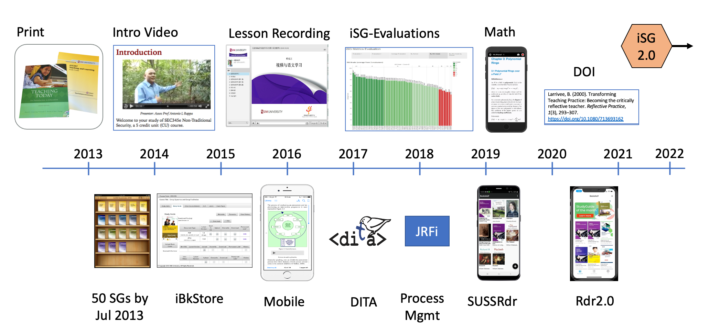

class: center middle

### .brown[just a moment]

.smaller[#### (use arrow keys to navigate)]

```{r include=FALSE}
knitr::opts_chunk$set(echo=FALSE, message=FALSE, warning=FALSE)
library(emoji)
library(tidyverse)
library(xaringan)
library(xaringanExtra)
xaringanExtra::use_tile_view()
xaringanExtra::use_panelset()
```
<style>
.brown{
   color: brown;
}
.blue{
  color: blue;
}
.red{
  color:red;
}
.smaller{
  font-size:smaller;
}
body { font-family: 'Yanone Kaffeesatz', 'Droid Serif', 'Palatino Linotype', 'Book Antiqua', 'Palatino', 'Microsoft YaHei', 'Songti SC', serif; }

h1, h2, h3, h4 {
  font-family: 'Yanone Kaffeesatz';
  font-weight: normal;
}
</style>
---
class: title-slide middle right

# i.Learn .brown[Web]
### Wong YueKee, PhD
---



.pull-left[
####  A lot of work has taken place in the last 7 years - both in  improving the presentation of the e-StudyGuide and in its distribution to the users.]
.pull-right[
#### But it is still within the context of an eBook eco-system.  It is time for change.

#### _-- wongyk 2021_ ]
---
class: middle, center, inverse
.pull-left[

<br>
<br>
### eBook Focus
]
.pull-right[

<br>
<br>
### Learning Focus
]
???
Move away from eBook paradigm
- which is basically "static" 
- based on reading/studying behaviour

To adaptive learning
- allow user customization - recommendations 
- track and synchronize reading at user level
- adapt to user pace and learning
---
class: inverse

.pull-left[
## Focus on: 
- ## web HTML   `r emo::ji("thinking")`

## Move away from:

- ## PDF  

- ## ePUB
]
.pull-right[

]

???

PDF issues
- static, non-interactive, no-media, no structure
- does not render well on current mobile devices

ePUB issues
- container packaging makes it restrictive
- now bandwidth savings no longer critical issue
- videos and chunked-lessons are now externally sourced
- limited local storage - stateless

HTML
- consistent and wider range of rendering modes and devices
- requires internet access
- better development tools
- server-side applications and storage
---

## We achieved good rendering with ePub and css !


--

## HTML uses the same schema ...

???
- The same rendering is afforded in HTML 
- but HTML offers more flexibility
- We need to transition out of a e-book paradigm
- iSGWeb will be a self-learning portal
---

.left-column[
<br>
<br>
<br>
### ...except we can do more things with WebHTML
### ...and with server-side programming
]

.right-column[

### Advantages:
- ### More device choices
  
- ### User accounts allows .brown[Synchronization] and  .brown[Subscriptions] (think Alumni)

- ### Server directs .brown[learning paths] and does .brown[recommendations] using graph or ML analyses

- ### Server side does .brown[e-payments]

- ### (.brown[full-stack web development]) allows for a lot more tech solutions
 ]
---
## Other features

-  ### More user .brown[customizations]
  + user notes and bookmarks
  + notes and knowledge exchange
  + social media exchange
  + help and learning services
  + early notifications
  + accessible learning (tts)
  
- ### .brown[Technology Aided Learning]
  + reminders - system set the pace
  + self assessment - system does the review
  + nudging - system does the nudging
  + adaptive learning - system redirects learning path

---
## Data Analytics

- .brown[Data capture] at DITA learning tags level

- Build with .brown[Big Data] in mind

- Build with .brown[Dashboards] in mind

## Predictive Modeling Approaches

- Statistical Modeling

- Graph Modeling

- Recommendation Engine

- Machine Learning 
  
---

## Document Workflow


---
class: top
## Core Technologies
.pull-left[
- ### Project management
  + Agile::Kanban
  + Github
  + .brown[Offshore Programming]
  
- ### Programming
  + NodeJS (Javascript)
  + APIs
  
- ### Cloud Storage and Services
  + AWS S3 Storage
  + AWS Service Instances
  + .brown[AI Cloud Services]
]

.pull-right[
- ### Databases
  + Exist (Document) DB
  + Neo4j Graph DB
  + mySQL DB
  
- ### Mobile Programming
  + iOS - Swift
  + Android - Kotlin
  + OAuth2
]

---
## References

  - [PacktPub](https://www.packtpub.com)
  
  - [OReilly](https://www.oreilly.com)
  
  - [InformIT](https://www.informit.com)
  
  - [Dummies Guide](https://dummies.com)

---


