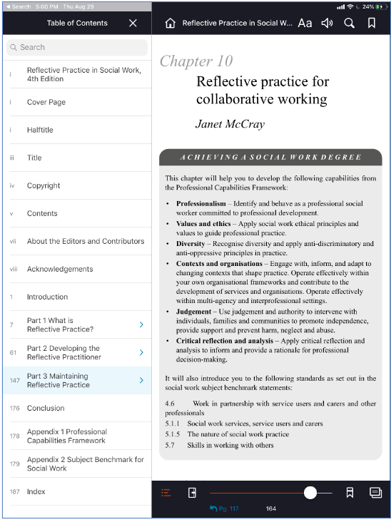
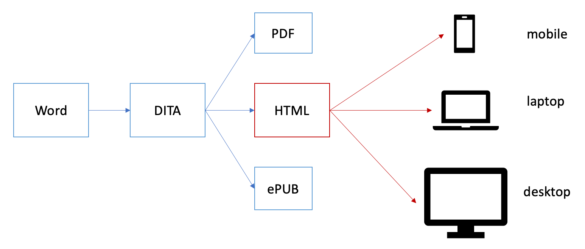

class: center middle

.brown[just a moment ...]

```{r include=FALSE}
knitr::opts_chunk$set(echo=FALSE, message=FALSE, warning=FALSE)
library(emoji)
library(tidyverse)
library(xaringan)
library(xaringanExtra)
xaringanExtra::use_tile_view()
xaringanExtra::use_panelset()
```
<style>
.brown{
   color: brown;
}
.blue{
  color: blue;
}
.red{
  color:red;
}
</style>
---
class: title-slide middle right

# i.Learn .brown[Web Project].
### Wong YueKee, PhD
---
class: middle, center, inverse
.pull-left[

<br>
<br>
eBook Focus
]
.pull-right[

<br>
<br>
Learning Focus
]
???
Move away from eBook paradigm
- basically "static" 
- reader behaviour (studying)

To adaptive learning
- customise based on user account
- track and synchronize reading 
- adapt to user pace and learning
---
class: inverse

.pull-left[
## Why change to: 
- ## HTML   `r emo::ji("thinking")`

## What's wrong with:

- ## PDF  

- ## ePUB
]
.pull-right[

]

???

PDF
- static, non-interactive, no-media
- doesn't render well on current mobile devices
- but printing is excellent because of fix format

ePUB
- was "text" based
- bandwidth savings no longer an important issue
- besides videos and chunked-lessons are now external
- excellent rendering and interactivity, but html can do more
- including server-side calls
- local storage

HTML
- more consistent and wider range of rendering
- wider range of devices
- longer shelf life
- better development tools
- server-side applications
- server-side storage
---
class: middlep

## iSG Rendering on SUSSReader


--

## HTML Renders the same way...

???
- The same rendering is afforded in HTML 
- HTML offers more flexibility
- Need to transition out of a e-book paradigm
- iSGWeb will be a self-learning portal
---

.left-column[
<br>
<br>
<br>
### ...except we can do more things with WebHTML
### ...and with server-side programming
]

.right-column[

### Advantages:

- HTML is more .brown[consistent] and plays well across devices
  
- can program for .brown[synchronization] with user accounts

- can program for external or non-SUSS .brown[subscription] accounts

- can program for .brown[learning paths]

- can program .brown[recommendations] with graph based or ML based analyses

- can program free and priced content with .brown[e-payment] systems

- web-development (.brown[full-stack programming]) allows for a lot more tech solutions
]
---
# Other features

- .brown[API integration] to user databases and LS services

- .brown[OAuth2] - mobile authentication

- More user .brown[customizations]
  + user notes and bookmarks
  + users exchange
  + social media interchange
  + help and learning exchanges
  + notifications
  + accessible learning (tts)
  
- .brown[Technology Aided Learning]
  + reminders - learner set the pace
  + self assessment - learner does the review
  + nudging - program does the nudging
  + adaptive learning - program redirects learning path

---
# Data Analytics

- .brown[Data capture] at DITA learning tags level

- Build with .brown[Big Data] in mind

- Build with .brown[Dashboards] in mind

## Predictive Modeling Approaches

- Statistical Modeling

- Graph Modeling

- Recommendation Engine

- Machine Learning 
  
---

# Document Workflow



---
## Core Technologies
.pull-left[
- ### Project management
  + Agile::Kanban
  + Github
  + .brown[Outsource Based]
  
- ### Programming
  + NodeJS
  + APIs
  + .brown[Javascript Language]
  
- ### Servers and Storage
  + AWS S3
  + AWS Instances
  + .brown[Cloud Services]
]

.pull-right[
- ### Databases
  + Exist DB
  + Neo4j Graph DB
  + mySQL DB
  + .brown[Document DB]
  
- ### Mobile Programming
  + iOS - Swift
  + Android - Kotlin


]

---
new slide page

---
## References

  - [PacktPub](https://www.packtpub.com)
  
  - [OReilly](https://www.oreilly.com)
  
  - [InformIT](https://www.informit.com)
  
  - [Dummies Guide](https://dummies.com)

---


